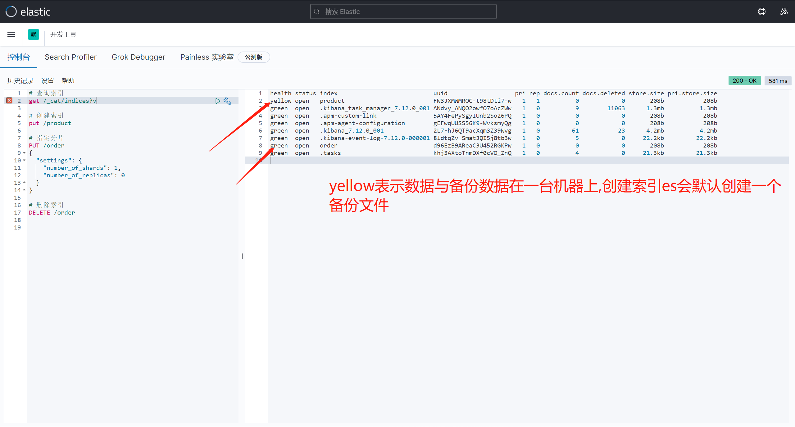

# 一、ES安装

## 1.1 Docker部署单机ES和Kibana

1、利用docker部署ES和kibana

```bash
docker pull elasticsearch:7.17.5
docker pull kibana:7.17.5

# 将docker里的目录挂载到linux的/mydata目录中
# 修改/mydata就可以改掉docker里的
mkdir -p /mydata/elasticsearch/config
mkdir -p /mydata/elasticsearch/data

# es可以被远程任何机器访问
# echo "http.host: 0.0.0.0" >/mydata/elasticsearch/config/elasticsearch.yml
# echo "xpack.security.enabled: false" >/mydata/elasticsearch/config/elasticsearch.yml
# 上述写法会被覆盖 elasticsearch.yml配置如下内容
http.host: 0.0.0.0
xpack.security.enabled: false

# 递归更改权限，es需要访问
chmod -R 777 /mydata/elasticsearch/

# 【启动ES】
# 9200是用户交互端口 9300是集群心跳端口
# -e指定是单阶段运行
# -e指定占用的内存大小，生产时可以设置32G
docker run --name elasticsearch -p 9200:9200 -p 9300:9300 \
-e  "discovery.type=single-node" \
-e ES_JAVA_OPTS="-Xms64m -Xmx512m" \
-v /mydata/elasticsearch/config/elasticsearch.yml:/usr/share/elasticsearch/config/elasticsearch.yml \
-v /mydata/elasticsearch/data:/usr/share/elasticsearch/data \
-v  /mydata/elasticsearch/plugins:/usr/share/elasticsearch/plugins \
-d elasticsearch:7.17.5 

# 设置开机启动elasticsearch
docker update elasticsearch --restart=always

# 【启动kibana】
# kibana指定了了ES交互端口9200  # 5600位kibana主页端口
docker run --name kibana -e ELASTICSEARCH_HOSTS=http://192.168.56.10:9200 -p 5601:5601 -d kibana:7.4.2


# 设置开机启动kibana
docker update kibana  --restart=always
```

2、测试安装是否成功

- 浏览器输入： http://192.168.56.10:9200 查看ES版本信息
- 显示elasticsearch 节点信息：http://192.168.56.10:9200/_cat/nodes
- 访问Kibana： http://192.168.56.10:5601/app/kibana

**kibana启动比较慢**

```Bash
# 查看集群健康状态
GET /_cat/health?v
# 查看节点健康状态
GET /_cat/nodes?v
# 查看索引信息
GET /_cat/indices?v
```


## Cenatos下单机ES安装

> https://blog.csdn.net/weixin_40816738/article/details/120426766


# 二、基本操作

## 2.1 操作索引

### 2.1.1 索引创建

1、创建

`PUT /索引名`

```json
PUT /products

{
  "acknowledged" : true,
  "shards_acknowledged" : true,
  "index" : "products"
}
```

2、创建索引 进行**索引分片配置**

```json
DELETE /products
PUT /products
{
  "settings": {
    "number_of_shards": 1, 
    "number_of_replicas": 0
  }
}

GET /_cat/indices
```


### 查询

- `GET /_cat/indices?v`



### 删除

```
DELETE /shopping2

DELETE /*     `*代表通配符,代表所有索引`
```


## 2.2 映射 mapping

### 创建

字符串类型: keyword 关键字 关键词 、`text` 一段文本

数字类型：integer long

小数类型：float double

布尔类型：boolean

日期类型：`date` ,默认三种格式

- 2018-01-13” 或 “2018-01-13 12:10:30”
- long类型的毫秒数
- integer的秒数

复合类型:

- 数组类型 array
- 对象类型 object ：JSON格式对象数据
- 嵌套类型 `nested`
- 地理类型 地理坐标类型 geo_point
- 地理地图 geo_shape
- 特殊类型 IP类型 ip
- 范围类型 completion
- 令牌计数类型 token_count
- 附件类型 attachment
- 抽取类型 percolator

```json
PUT /products2
{ 
  "settings": {
    "number_of_shards": 1,
    "number_of_replicas": 0
  }, 
  "mappings": {
    "properties": {
      "title":{
        "type": "keyword"
      },
      "price":{
        "type": "double"
      },
      "cart_id":{
        "type": "date"
      },
      "description":{
        "type": "long"
      },
      "cart_info" : {
          "type" : "nested",
          "properties" : {
            "bargainId" : {
              "type" : "long"
            },
            "cartNum" : {
              "type" : "integer"
            }
          }
      },
      "store_name" : {
          "type" : "text",
          "fields" : {
            "keyword" : {
              "type" : "keyword",
              "ignore_above" : 256
            }
          }
        },
        "createtime" : {
          "format" : "yyyy-MM-dd'T'HH:mm:ss.SSS'Z'||yyyy-MM-dd HH:mm:ss||yyyy-MM-dd||epoch_millis",
          "index" : true,
          "type" : "date",
          "doc_values" : true
        }
    }
  }
}
```

> 说明
>
> 说明: ES中支持字段类型非常丰富，如：text、keyword、integer、long、ip 等。更多参见https://www.elastic.co/guide/en/elasticsearch/reference/7.15/mapping-types.html

### 查询

```
GET /products2/_mapping
```


### 索引数据复制

解决,源索引映射不符合目前需求,需要替换源索引,`改为新的映射关系`

```json
POST _reindex
{
  "source": {
    "index": "products2"
  }
  , "dest": {"index":  "products3"}
}
```


## 2.3 文档

### 添加文档

es默认会为es添加id,格式为uuid

```
PUT /products/_doc/3
{
  "title":"iphone14",
  "price":99.9,
  "create_time":"2022-04-04",
  "description":"iPhone 14屏幕采用6.1英寸OLED屏幕。"
}
```

如果不指定id，**必须用POST请求**

```json

POST /products/_doc/
{
  "title":"iphone14",
  "price":99.9,
  "create_time":"2022-04-04",
  "description":"iPhone 14屏幕采用6.1英寸OLED屏幕。"
}
```

### 查询文档

```
GET /products/_doc/3

{
  "_index" : "products",
  "_type" : "_doc",
  "_id" : "3",
  "_version" : 1,
  "_seq_no" : 0,
  "_primary_term" : 1,
  "found" : true,
  "_source" : {
    "title" : "iphone14",
    "price" : 99.9,
    "create_time" : "2022-04-04",
    "description" : "iPhone 14屏幕采用6.1英寸OLED屏幕。"
  }
}
```

### 删除文档

```json
DELETE /products/_doc/1
```


### 更新文档

1、彻底更新

- PUT请求

```json
PUT /products/_doc/3
{
  "title":"iphone15"
}
GET /products/_doc/3
```

> 说明: 这种更新方式是先删除原始文档,在将更新文档以新的内容插入。

2、保留更新 

 这种方式可以将数据原始内容保存,并在此基础上更新。相当于**局部更新**。

```
POST /products/_update/3
{
  "doc" : {
    "title" : "iphon15"
  }
}
GET /products/_doc/3
```

## 2.4 高级查询

### 说明		

ES中提供了一种强大的检索数据方式,这种检索方式称之为`Query DSL<Domain Specified Language>`,Query DSL是利用Rest API传递JSON格式的请求体(Request Body)数据与ES进行交互，这种方式的丰富查询语法让ES检索变得更强大，更简洁。

### 语法

```json
 GET /索引名/_search {json格式请求体数据}
```


准备数据

```json
PUT /products/_doc/1
{"title":"iphone14","price":8999.99,"created_at":"2021-09-14","description":"iPhone 14屏幕采用6.8英寸OLED屏幕"}

PUT /products/_doc/2
{"title":"iphone13","price":89.99,"created_at":"2021-09-13","description":"iPhone 13屏幕采用6.8英寸OLED屏幕"}

PUT /products/_doc/3
{"title":"iphone15","price":899.99,"created_at":"2021-09-12","description":"iPhone 15屏幕采用6.8英寸OLED屏幕"}

PUT /products/_doc/4
{"title":"联想笔记本电脑","price":6888,"created_at":"2022-08-13","description":"24G运行内存，256G机械硬盘"}

PUT /products/_doc/5
{"title":"华为平板","price":4668,"created_at":"2023-01-21","description":"集成手机和电脑的功能"}
```


### 查询所有 match_all

```json
GET /products/_search
{
  "query": {
    "match_all": {}
  }
}
```


### 关键词不分词查询

> term
>
> term查询text字段,因为text字段会分词，而term不分词，所以term查询的条件必须是text字段分词后的某一个。 term查询keyword字段。 term不会分词。而keyword字段也不分词。需要完全匹配才可。

```json
GET /products/_search
{
 "query": {
   "term": {
     "price": {
       "value": 899.99
     }
   }
 }
}
```

### 关键字分词查询(match)

> match查询text字段,match分词，text也分词，只要match的分词结果和text的分词结果有相同的就匹配。 match查询keyword字段,match会被分词，而keyword不会被分词，match的需要跟keyword的完全匹配可以。

```json
GET /products/_search
{
  "query": {
    "match": {
      "description": "功能"
    }
  }
}
```


### in查询(terms)

> in
>
> 类似 select * from user where id in (1,2,4,5);

```json
PUT /student/_doc/1
{"id":1, "name":"张三", "age": 21, "group":1, "address":"上海市徐汇区"}
PUT /student/_doc/2
{"id":2, "name":"李四", "age": 21, "group":2, "address":"江西省上饶市"}
PUT /student/_doc/3
{"id":3, "name":"王五", "age": 21, "group":3, "address":"湖北省武汉市"}
PUT /student/_doc/4
{"id":4, "name":"马六", "age": 21, "group":4, "address":"上海市徐汇区"}

GET /student/_search
{
  "query": {
    "bool": {
      "must": [
        {
          "terms": {
            "group": [1,2]
          }
        }
      ]
    }
  }
}
```


# 三、索引原理

## 倒排索引

`倒排索引（Inverted Index）`也叫反向索引，有反向索引必有正向索引。通俗地来讲，**正向索引是通过key找value，反向索引则是通过value找key。ES底层在检索时底层使用的就是倒排索引。**